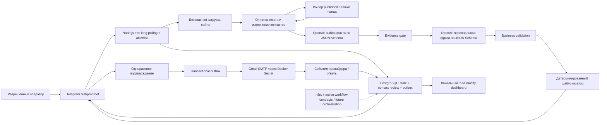

# Workoutreach — техническое задание

> Статус: Final v1.4 — pilot contact resolution + hybrid local runtime
> Дата: 20 июля 2026 года
> Целевой каталог: `C:\Dev\workoutreach`  
> Назначение: единый источник требований для реализации самостоятельного продукта в новом проекте и новом чате Codex.  
> Режим происхождения: 0% donor code/data/config; 100% новая project-authored реализация.

## 0. Непереговорные инварианты

1. Все принадлежащие продукту исходники, workflow, prompts, schemas, migrations, templates, fixtures, tests, scripts и документация создаются заново внутри `C:\Dev\workoutreach`.
2. Старые локальные проекты не читаются, не индексируются, не сравниваются и не используются как справочный материал или источник реализации.
3. AI анализирует данные и формирует предложения, но не получает права отправлять письма, менять конфигурацию или обходить deterministic gates.
4. Ни один факт не принимается без локально проверяемого evidence из реально загруженной страницы.
5. Каждое письмо требует явного одноразового human approval; auto-send отсутствует.
6. PostgreSQL является единственным источником бизнес-состояния, а outbox и idempotency защищают от повторной отправки.
7. Секреты, PII fixtures и runtime payload не попадают в Git, workflow exports, Telegram и модель.
8. Чистое развёртывание, происхождение зависимостей, тесты и эксплуатационные процедуры должны быть воспроизводимы без истории старых проектов и чатов.

## 1. Правила передачи в новый чат

Новый чат должен считать этот документ основным контрактом проекта. При противоречии между реализацией и ТЗ приоритет имеет ТЗ, если владелец проекта явно не изменил требование.

В первом цикле новый чат должен:

1. Прочитать ТЗ полностью.
2. Осмотреть только новый проект.
3. Составить поэтапный план.
4. Реализовать этапы 0 и 1: каркас, инфраструктуру разработки и полный dry-run до Telegram-предпросмотра.
5. Не подключать реальную отправку писем и не запрашивать почтовые секреты до приёмки dry-run.

Старый проект `C:\Dev\coldmails` и любые другие локальные репозитории-доноры находятся вне области доступа и реализации. Новый чат не должен открывать, перечислять, искать, индексировать, сравнивать или изменять их даже для «вдохновения» или проверки сходства.

## 2. Принятое архитектурное решение

Проект создаётся с нуля в отдельном репозитории `C:\Dev\workoutreach`.

Используется строгий greenfield-подход без исключений в рамках этой версии ТЗ:

- все source files, n8n workflow и Code nodes, prompts, JSON Schemas, SQL migrations, templates, fixtures, tests, scripts и docs пишутся заново;
- запрещены copy/paste, перевод, адаптация, «очистка» или генеративная имитация материалов из любого проекта-донора;
- допустимые источники требований и знаний: это ТЗ, прямые материалы владельца, официальная документация поставщиков, открытые стандарты и third-party packages через package manager после проверки лицензии и происхождения;
- готовые инфраструктурные продукты и библиотеки не переписываются с нуля: используются PostgreSQL, n8n, Docker, reverse proxy и поддерживаемые SDK, но конфигурация и интеграционный код продукта создаются заново;
- недостающее решение оформляется новым ADR на основании требований и официальных источников, а не поиском аналога в старом коде;
- строгая изоляция и проверка происхождения описаны в разделе 19.

Самостоятельная техническая реализация снижает риск унаследовать legacy-ошибки, секреты и скрытые зависимости, но сама по себе не доказывает юридическую уникальность названия, товарного знака или патентную чистоту. Перед коммерческим запуском отдельно проверяются бренд и применимые права.

Идентичность продукта фиксируется с первого коммита:

- product/namespace: `workoutreach`;
- Docker Compose project: `workoutreach`;
- service names: `workoutreach-n8n`, `workoutreach-postgres`, `workoutreach-proxy`;
- публичный job ID: префикс `WO-`;
- новые database roles, schemas, volumes, networks и secrets получают только project-owned имена без legacy namespace.

Фактический базовый стек:

- Telegram Bot API `getUpdates` — локальный allowlisted ввод URL, выбор контакта, предпросмотр, подтверждение и статусы;
- отдельный hardened Node.js service — текущий critical path: crawl, deterministic gates, OpenAI Responses API, Telegram и SMTP dispatcher;
- PostgreSQL — единственный источник бизнес-состояния, очереди и идемпотентности;
- OpenAI Responses API — два прямых server-side вызова со strict Structured Outputs, `store=false`, без tools;
- Gmail authenticated SMTP submission — текущий owner-approved transport после ручного подтверждения; пароль приложения только в Docker Secret;
- n8n self-hosted — локальный визуальный и будущий orchestration layer; импортированные workflow-контракты неактивны и не дублируют отправку;
- Caddy — loopback-only HTTPS для n8n/dashboard; публичная точка входа в локальном режиме отсутствует.

## 3. Цель продукта

Оператор отправляет боту только URL публичного сайта компании. Система безопасно изучает ограниченный набор страниц, находит подтверждаемый факт и опубликованные контактные адреса, создаёт персональную фразу, вставляет её в фиксированный шаблон письма и присылает полный предпросмотр в Telegram.

Письмо отправляется только после явного одноразового подтверждения разрешённого пользователя. После отправки бот сообщает точный технический статус, не называя письмо «доставленным во входящие», если известно только принятие провайдером или почтовым сервером адресата.

Главная оптимизируемая характеристика — проверяемая релевантность, а не объём отправки.

## 4. Объём MVP

В MVP входят:

- один оператор и allowlist Telegram user/chat ID;
- один production-бот и отдельный test-бот;
- одно активное предложение и один утверждённый шаблон письма;
- один язык шаблона, `ru` по умолчанию;
- ввод одного публичного URL;
- загрузка до шести HTML-страниц одного сайта;
- извлечение только реально опубликованных email-адресов;
- двухэтапный AI-анализ;
- строгая проверка факта, источника и длины фразы;
- Telegram-предпросмотр и кнопки подтверждения;
- одна отправка одному адресату;
- журнал статусов, suppression list, защита от дублей;
- обработка доступных событий почтового провайдера.

В MVP не входят:

- массовые рассылки;
- последовательности и автоматические follow-up;
- автоматическая отправка без человека;
- угадывание email по имени или домену;
- покупные, scraped или внешние базы контактов;
- CRM и legacy-интеграции;
- альтернативные LLM-провайдеры и унаследованные workflow;
- поиск контактов в социальных сетях;
- обход авторизации, CAPTCHA или paywall;
- headless browser для каждого сайта;
- multi-tenant режим;
- AI Agent с инструментами и правом выполнять действия.

Исключение, принятое ADR-0009: локальная read-mostly операторская панель компаний входит в продукт как операционная витрина. Она не является CRM, не добавляет sequences/follow-up automation, не редактирует письма и не является новым approval- или send-каналом.

## 5. Пользовательский сценарий

### 5.1. Основной поток

1. Оператор отправляет test/prod-боту сообщение с одним URL.
2. Бот немедленно отвечает коротким ID задания, например `WO-7H3K9Q`, и статусом «принято».
3. Система проверяет Telegram allowlist, дедупликацию обновления и безопасность URL.
4. Система загружает ограниченный набор разрешённых страниц и извлекает чистый текст.
5. Контактные email извлекаются детерминированно из `mailto:` и видимого текста.
6. Первый AI-вызов выбирает подтверждаемый факт и возвращает evidence по строгой JSON Schema.
7. Детерминированный evidence gate проверяет результат.
8. Второй AI-вызов получает только принятый факт и утверждённое описание предложения, затем создаёт персональную фразу и пересечение.
9. Второй результат проходит schema- и business-валидацию.
10. Фиксированный шаблонизатор вставляет только разрешённые поля.
11. Бот присылает полный предпросмотр письма, контакт, источник, проверку и предупреждения.
12. Оператор выбирает «Отправить», «Перегенерировать» или «Отклонить».
13. После «Отправить» система атомарно проверяет suppression и дедупликацию, создаёт outbox-запись и выполняет одну отправку.
14. Бот обновляет статус по фактически полученным событиям.

### 5.2. Контакт не определён однозначно

- Если email не найден, задание получает `NEEDS_CONTACT`; отправка недоступна.
- Если найдено несколько релевантных адресов, оператор должен выбрать один в Telegram.
- Если назначение ящика сомнительно, задание получает `NEEDS_REVIEW`.
- Адреса вида `jobs@`, `career@`, `hr@`, `rabota@` не выбираются для коммерческого предложения без явного подтверждения оператора.
- Оператор может ввести известный ему email вручную; источник фиксируется как `manual`, и подтверждение всё равно обязательно.
- Система никогда не генерирует и не проверяет адрес отправкой «пробного» письма.

### 5.3. Telegram-предпросмотр

Предпросмотр обязан содержать:

```text
#WO-7H3K9Q · ГОТОВО К ПРОВЕРКЕ

Компания: ...
Сайт: ...
Адресат: ...
Источник адреса: ...

ПЕРСОНАЛЬНАЯ ФРАЗА
...

ИСТОЧНИК
Название/тип страницы
URL
Точная выдержка

ПРОВЕРКА
Факт: ...
Пересечение с предложением: ...
Длина: N слов
Предупреждения: ...

ТЕМА
...

ПИСЬМО
...
```

Кнопки:

- `Отправить`;
- `Перегенерировать`;
- `Отклонить`;
- `Выбрать адрес`, только если есть несколько кандидатов.

Предпросмотр действителен 24 часа. После истечения срока требуется повторный анализ или явное обновление. Разрешено не более двух перегенераций одного задания; каждая версия сохраняется отдельно.

## 6. Логическая архитектура



Принцип разделения полномочий:

- модель анализирует только данные и никогда не имеет почтовых, Telegram- или БД-инструментов;
- AI-ответ не может сам инициировать отправку;
- URL для загрузки выбирает код, а не модель;
- email извлекает код, а не модель;
- письмо собирает фиксированный шаблонизатор;
- отправку разрешает только оператор и атомарный state transition.

## 7. Runtime и n8n workflow-контракты

Фактический локальный critical path выполняет отдельный тестируемый Node.js service. Это уменьшает количество привилегированных компонентов, позволяет применять DNS/redirect SSRF-gates до каждого запроса и не создаёт второй send path. n8n остаётся установленным локальным визуальным orchestration layer. Его exports должны быть небольшими, именованными, credential-free и неактивными до отдельного ADR о переводе конкретной ответственности.

Запрещено поддерживать параллельные активные реализации одной отправки в Node.js и n8n. PostgreSQL остаётся общей точкой истины при любом будущем переносе.

### `01_telegram_ingest` — неактивный контракт

- Telegram Trigger: `message` и `callback_query`;
- проверка `user_id` и `chat_id` по allowlist;
- дедупликация по Telegram `update_id`;
- разбор URL или команды;
- создание задания;
- вызов `02_analyze_company`;
- быстрый ответ на callback через `answerCallbackQuery`.

### `02_analyze_company` — неактивный контракт

- нормализация и security gate URL;
- ограниченная загрузка страниц;
- HTML-to-text;
- извлечение контактов;
- OpenAI fact extraction;
- evidence gate;
- OpenAI phrase generation;
- business validation;
- создание версии черновика;
- вызов `03_render_review`.

### `03_render_review` — неактивный контракт

- сборка темы, plain-text и HTML из фиксированных шаблонов;
- экранирование динамических значений;
- сохранение immutable draft version;
- отправка/обновление Telegram-предпросмотра.

### `04_telegram_actions` — неактивный контракт

- проверка allowlist, action nonce, TTL и состояния задания;
- `send`, `regenerate`, `reject`, `select_recipient`;
- атомарное создание outbox при `send`;
- идемпотентный ответ на повторный callback.

### `05_mock_dispatch` — неактивный контракт

- Schedule Trigger с малым интервалом;
- claim одной `pending` outbox-записи через блокировку;
- повторная проверка suppression непосредственно перед отправкой;
- только mock-dispatch; реальный Gmail SMTP dispatcher находится в Node.js service;
- сохранение точного mock-результата без provider message ID;
- невозможность внешней передачи письма.

### `06_mail_events` — не реализован

- webhook или безопасный polling, если это поддерживает выбранный провайдер;
- проверка подписи webhook по raw body;
- дедупликация event ID;
- нормализация `mx_accepted`, `bounced`, `complained`, `unsubscribed`, `replied`;
- обновление suppression и Telegram-статуса.

### `90_error_handler` — неактивный контракт

- единый Error Trigger;
- сохранение безопасного error code и этапа;
- Telegram-сообщение без payload, секретов, HTML и stack trace;
- correlation по `job_id` и execution ID.

## 8. Безопасная загрузка сайта

Любой присланный URL считается недоверенным вводом.

Обязательные проверки до первого запроса и после каждого redirect:

- схема только `http` или `https`;
- отсутствие `userinfo`, фрагмента и нестандартных портов;
- разрешены только порты 80 и 443;
- запрет literal IPv4/IPv6, `localhost`, `.local` и внутренних имён;
- HTTP-транспорт получает только предварительно проверенные globally routable DNS A/AAAA; loopback, private, link-local, multicast, documentation и иные reserved ответы отбрасываются до DNS pinning, а отсутствие хотя бы одного публичного адреса останавливает загрузку;
- redirect не может выводить на запрещённый адрес;
- внутренние страницы — только тот же hostname или явно разрешённый поддомен;
- TLS verification нельзя отключать;
- n8n SSRF protection обязательно включена; сетевой firewall остаётся вторым независимым рубежом.

Лимиты MVP:

- максимум 6 страниц;
- максимум 3 redirect на запрос;
- timeout 10 секунд на страницу и 60 секунд на всё задание;
- только `text/html` и безопасный текстовый ответ;
- максимум 2 МБ ответа на страницу;
- максимум 120 000 символов очищенного текста на задание;
- raw HTML не сохраняется в бизнес-БД;
- cookies, формы, авторизация и загрузка файлов запрещены;
- `robots.txt` учитывается;
- фиксированный честный User-Agent проекта.

Приоритет ссылок определяется кодом:

1. главная;
2. about/company;
3. products/services;
4. cases/projects/reviews;
5. news/blog;
6. contacts.

Модель не может запросить дополнительный URL. Если статический HTML не содержит достаточных данных, результат — `NEEDS_REVIEW`; headless browser не включается автоматически.

## 9. Извлечение и выбор email

Email извлекаются до AI-вызовов:

- из `mailto:`;
- из видимого текста загруженных страниц;
- с фиксацией `source_id`, URL, точной выдержки и типа страницы;
- с синтаксической проверкой, дедупликацией и нормализацией для сравнения;
- без угадывания, enrichment и сторонних баз.

Каждый кандидат получает детерминированную категорию:

- `general`;
- `sales`;
- `support`;
- `recruiting`;
- `privacy_or_legal`;
- `personal_named`;
- `unknown`.
- `manual` — только для адреса, явно введённого владельцем; для опубликованного extraction не назначается.

Отдельное поле provenance принимает `published` или `manual`. Оно не выводится моделью и не может быть повышено из `manual` в `published` без повторного literal extraction.

Выбор адреса зависит от назначения кампании. `recruiting`, `support`, `privacy_or_legal` автоматически не выбираются для sales/outreach. Если подходящий адрес один, он предлагается оператору; если несколько или категория `unknown`, требуется ручной выбор.

Проверка MX допустима как сигнал, но не подтверждает существование конкретного mailbox и не заменяет human review.

## 10. OpenAI-анализ

### 10.1. API и модель

- использовать OpenAI Responses API из server-side Node.js adapter; будущий перенос в n8n допускается только при сохранении тех же canonical schemas и gates;
- использовать `Output Format: JSON Schema` / Structured Outputs;
- `Store=false`;
- не использовать AI Agent, web search, function calling и иные tools;
- имя модели хранить в конфигурации, а фактический model ID — в каждой записи анализа;
- quality reference для первоначального manual eval: актуальный alias `gpt-5.6` (Sol на момент утверждения ТЗ);
- `gpt-5.6-terra` является production-кандидатом на снижение стоимости только после сравнения на том же представительном eval-наборе: без регрессии по evidence/factuality hard gates и без роста неподтверждённых утверждений;
- fact extraction и phrase generation имеют независимые model settings, но по умолчанию сохраняют quality reference до одинакового representative eval;
- для уникальных company payloads implicit prompt-cache breakpoint отключён через explicit cache mode без breakpoint; cache включается только при измеримом повторном prefix reuse;
- ChatGPT subscription/web-session не используется как API credential: приложение переиспользует только существующий project API key из Docker Secret;
- reasoning effort задаётся явно, начинается с минимального уровня, прошедшего eval, и не повышается без измеримого улучшения;
- конкретную модель или effort разрешается менять только отдельным конфигурационным изменением после одинакового eval, с фиксацией качества, latency и стоимости;
- prompt, schema и offer profile версионируются, их hashes сохраняются с результатом.

### 10.2. Два независимых вызова

Вызов A получает размеченные фрагменты страниц (`source_id` + text) и выбирает один конкретный факт. Он не получает почтовые credentials, шаблон письма или право формировать действие.

Вызов B получает только:

- принятый факт;
- подтверждённую выдержку;
- тип источника;
- утверждённый offer profile;
- язык и ограничения персональной фразы.

Вызов B не получает полный сайт. Это уменьшает влияние prompt injection и делает результат проще для проверки.

### 10.3. Обращение с содержимым сайта

В developer-инструкции явно указать, что текст сайта — данные, а любые инструкции внутри него необходимо игнорировать. Контент отделяется структурными delimiters и source IDs. Ни один фрагмент сайта не подставляется в system/developer prompt как инструкция.

Refusal, incomplete output/truncation, отсутствие обязательного поля или schema error являются контролируемым неуспехом и не заменяются выдуманными значениями. Причина сохраняется в безопасной технической форме. Разрешён один контролируемый повтор; затем задание переводится в `NEEDS_REVIEW` или `FAILED`.

## 11. Контракт AI-результата

Финальный агрегированный объект должен соответствовать отдельной JSON Schema с `additionalProperties: false`. URL и техническая metadata добавляются приложением, а не моделью. Для каждого AI-вызова существует один canonical schema source; типы, n8n-конфигурация и contract tests генерируются из него или проверяются CI на идентичность, чтобы параллельные копии контракта не расходились.

Минимальный логический контракт:

```json
{
  "company_name": "Profi Soft",
  "fact": "Компания опубликовала кейс квалифицирующего ИИ-бота, который фиксирует данные в CRM и переводит сделки по стадиям.",
  "source_id": "p04",
  "source_excerpt": "...точная выдержка из нормализованного текста...",
  "source_type": "case_study",
  "published_at": null,
  "personalization_phrase": "Опубликованный вами кейс ... напрямую пересекается с ...",
  "overlap": "Факт связан с утверждённым предложением через ...",
  "word_count": 29,
  "confidence": 0.91,
  "decision": "READY_FOR_REVIEW",
  "warnings": []
}
```

Допустимые `decision`:

- `READY_FOR_REVIEW`;
- `NEEDS_CONTACT`;
- `NEEDS_REVIEW`;
- `REJECTED_INSUFFICIENT_EVIDENCE`.

`confidence` — только диагностический сигнал модели. Итоговое решение принимает код по обязательным gates.

## 12. Evidence gate и правила персональной фразы

Результат допускается к предпросмотру только если выполнены все условия:

- `source_id` существует в списке реально загруженных страниц;
- `source_excerpt` после одинаковой нормализации пробелов буквально присутствует в тексте этого source;
- факт не содержит существенных утверждений, которых нет в выдержке;
- company name подтверждён сайтом или доменом и не выдуман;
- published date либо подтверждена, либо равна `null`; неподтверждённое ненулевое значение модели детерминированно заменяется на `null` с видимым оператору предупреждением;
- offer overlap использует только утверждения из versioned offer profile;
- персональная фраза содержит предпочтительно 25–35 слов и строго не выходит за диапазон 18–40 слов для утверждённой карьерной кампании;
- язык фразы совпадает с языком активного шаблона;
- фраза не содержит email, телефона, секретов или чувствительных персональных данных;
- отсутствуют ложная похвала, выдуманные результаты, неподтверждённые цифры и обещания;
- фраза не содержит инструкций, кода, Markdown-ссылок и HTML;
- предупреждения, требующие человека, не скрыты.

Система вычисляет `word_count` самостоятельно и не доверяет числу модели. При провале любого обязательного условия письмо не собирается автоматически.

## 13. Шаблон письма

AI не генерирует письмо целиком. Тема, основной текст и подпись хранятся как утверждённые versioned templates. В индивидуальном пилоте до 50 вручную проверенных писем отдельная opt-out-фраза в теле письма не используется; любой отрицательный ответ вручную вносится в suppression до следующего контакта.

Минимальные файлы:

```text
templates/email/ru/v1/subject.txt
templates/email/ru/v1/body.txt
templates/email/ru/v1/body.html
product/offer-profile.v1.yaml
```

Разрешённые placeholders задаются allowlist. Обязательный placeholder:

```text
{{PERSONALIZATION_PHRASE}}
```

Дополнительные placeholders допускаются только после явного описания и тестов, например `{{COMPANY_NAME}}`, `{{SENDER_NAME}}`, `{{OPT_OUT_TEXT}}`.

Требования:

- неизвестный placeholder — ошибка сборки;
- динамические значения экранируются для HTML;
- plain-text версия обязательна;
- template version и hash сохраняются с draft;
- после подтверждения draft immutable;
- model output никогда не может изменить подпись, ссылки, адрес отправителя или правила suppression.

## 14. Telegram и подтверждение

Для рабочего взаимодействия используется один бот: он принимает URL, показывает письмо и сообщает статусы. Второй бот нужен только для полного разделения test и production, потому что один Telegram bot token должен иметь один активный webhook-контур.

Безопасность действий:

- allowlist одновременно по `user_id` и `chat_id`;
- callback data содержит только короткий action, short job ID и одноразовый nonce;
- nonce хранится в виде hash, имеет TTL и погашается атомарно;
- callback повторно проверяет владельца задания и текущее состояние;
- Telegram `callback_query` всегда быстро получает `answerCallbackQuery`;
- тело письма, email и секреты не помещаются в callback data;
- повторное нажатие «Отправить» возвращает прежний результат и не создаёт второе письмо.

Команды MVP:

- сообщение с URL — создать задание;
- `/status [job_id]` — безопасный статус runtime или задания;
- `/next` — следующее задание, требующее решения оператора;
- `/queue` — ограниченный список actionable заданий с агрегатами по статусам;
- `/usage` — UTC-day counters анализов, токенов и SMTP acceptance без приблизительной стоимости;
- `/email <job_id> <address>` — явный ввод достоверно известного адреса с provenance `manual`;
- `/approve <job_id>` — новый одноразовый SMTP callback для уже проверенного immutable draft;
- `/help` — краткая инструкция.

Если найдено несколько допустимых опубликованных email, модель ещё не вызывается. Кандидаты, категория и источник сохраняются в PostgreSQL и показываются оператору; защищённые категории могут быть видимы для контекста, но не получают кнопку выбора. Callback содержит только `job_id`, database candidate ID и одноразовый nonce; nonce хранится как SHA-256, ограничен TTL и погашается атомарно. После выбора сайт загружается повторно, а опубликованный адрес обязан снова встретиться буквально и оставаться разрешённым contact-policy, иначе результат `CONTACT_SELECTION_STALE`.

Ручной адрес никогда не угадывается и принимается только явной командой владельца для активного `NEEDS_CONTACT`/`NEEDS_REVIEW`. Он сохраняется с `category=manual`, `provenance=manual`, видимо маркируется в Telegram/audit и не передаётся модели.

## 15. Состояния и точная терминология

Состояние задания и события письма хранятся отдельно.

### Состояние задания

```text
RECEIVED
FETCHING
ANALYZING
NEEDS_CONTACT
NEEDS_REVIEW
DRAFT_READY
APPROVED
SENDING
PROVIDER_ACCEPTED
REJECTED
CANCELLED
EXPIRED
FAILED
```

Разрешённые переходы задаются таблицей/кодом; произвольная запись статуса запрещена.

### События письма

```text
MX_ACCEPTED
BOUNCED_TEMPORARY
BOUNCED_PERMANENT
COMPLAINED
UNSUBSCRIBED
REPLIED
```

`PROVIDER_ACCEPTED` означает только то, что API/SMTP-провайдер принял запрос. `MX_ACCEPTED` означает принятие почтовым сервером адресата и не доказывает попадание во «Входящие» или прочтение.

## 16. PostgreSQL и модель данных

PostgreSQL — источник истины; n8n execution history не используется как бизнес-БД.

Минимальные таблицы:

- `jobs` — URL, operator, status, timestamps, error code;
- `telegram_updates` — уникальный `update_id` и результат обработки;
- `pages` — source metadata, content hash, краткий очищенный текст или ссылка на временное хранение;
- `contact_candidates` — email, category, source, validation flags и `published|manual` provenance;
- `analyses` — immutable model/prompt/schema/offer versions и результат;
- `drafts` — immutable version, subject, text, html, template hash;
- `approval_tokens` — hashed nonce, operator, TTL, consumed_at;
- `contact_review_tokens` — отдельный hashed nonce для выбора опубликованного кандидата до создания draft;
- `outbox` — уникальная команда отправки и её состояние;
- `message_events` — нормализованные provider events;
- `suppression` — recipient HMAC, reason и дата;
- `audit_log` — значимые действия без секретов и raw payload.

Обязательные ограничения:

- unique Telegram `update_id`;
- unique `(job_id, draft_version)`;
- unique активная отправка `(job_id, draft_version)`;
- unique provider event ID;
- unique provider message ID, если он присутствует;
- unique suppression recipient HMAC;
- foreign keys и check constraints для статусов;
- UTC timestamps;
- миграции в Git, ручное изменение production schema запрещено.

n8n metadata и outreach business data должны использовать отдельные базы или как минимум отдельные роли/схемы с минимальными правами.

### 16.1. Локальная операторская панель

ADR-0009 добавляет отдельный локальный сервис `workoutreach-dashboard` по адресу `https://dashboard.workoutreach.localhost`. Это read-mostly операционная витрина, а не CRM и не новый канал отправки. Она не может отправить/повторить письмо, подтвердить Telegram draft, вызвать OpenAI, изменить `jobs`/`outbox`, редактировать immutable drafts/analyses, создать фиктивный provider event, удалить историю или снять suppression.

Технический delivery status вычисляется только из `jobs`, `outbox` и `message_events`. Единственный текущий признак реальной отправки: `outbox.transport='smtp' AND outbox.status='SMTP_ACCEPTED'`. UI называет его «Отправлено — принято Gmail SMTP» и обязательно поясняет, что acceptance не подтверждает доставку во входящие или прочтение. Mock, approval, draft, Gmail self-test, `SMTP_PENDING` и `SMTP_CLAIMED` отправкой не считаются.

Отдельный engagement status компании в кампании принимает только:

- `NOT_CONTACTED` — «Не отправлено»;
- `SENT_WAITING` — «Отправлено · ждём ответа»;
- `REPLIED` — «Ответили»;
- `INTERESTED` — «Есть интерес»;
- `FOLLOW_UP_LATER` — «Вернуться позже»;
- `NOT_INTERESTED` — «Не актуально»;
- `DO_NOT_CONTACT` — «Не связываться».

`SENT_WAITING` и неизменяемый вручную `sent_at` появляются только после SMTP acceptance. `FOLLOW_UP_LATER` требует `next_action_at`. `DO_NOT_CONTACT` требует отдельного подтверждения, терминален в UI и блокирует новые outbox-команды на уровне БД. При просьбе адресата одна серверная транзакция добавляет в suppression HMAC точного адресата принятого письма; dashboard не получает HMAC secret.

Миграция 008 создаёт `companies`, связь `jobs.company_id`, `company_campaign_state`, append-only `company_status_history` и versioned dashboard views. Одна строка списка соответствует компании и кампании; hostname является уникальным каноническим ключом, а имя берётся только из подтверждённого immutable analysis с fallback на hostname. Отправленный draft связывается точной парой `outbox.job_id + outbox.draft_version`.

Отдельная роль `workoutreach_dashboard` имеет SELECT только на dashboard views и EXECUTE на ограниченные dashboard-функции. Status update использует `SECURITY DEFINER`, фиксированный `search_path`, allowlists, row lock, expected version, идемпотентный action key, append-only history и безопасный audit event. Для существующего volume роль provisionится отдельной идемпотентной командой, а не только init hook.

Сервис работает на Node.js 24 + `pg` + vanilla HTML/CSS/JavaScript, подключён только к internal network, не имеет host port/egress и SMTP/OpenAI/Telegram secrets, запускается non-root с read-only filesystem, dropped capabilities и `no-new-privileges`. Вход защищён scrypt password hash, ограничением попыток, короткой host-only Secure/HttpOnly/SameSite=Strict session, CSRF, exact Host/Origin, CSP, method/content-type/body limits и parameterized SQL.

## 17. Идемпотентность, retry и сбои

Идемпотентность обязательна на уровнях:

- Telegram update;
- job creation;
- callback action;
- draft version;
- outbox send command;
- provider event.

Approval transaction должна одновременно:

1. заблокировать job;
2. проверить `DRAFT_READY`, TTL, operator и suppression;
3. погасить nonce;
4. установить `APPROVED`;
5. вставить единственную `pending` outbox-запись;
6. завершить commit.

Retry policy:

- fetch и OpenAI: exponential backoff с jitter только для timeout, 429 и 5xx; максимум два повтора;
- постоянные 4xx и ошибки валидации не повторяются бесконечно;
- SMTP/API 5xx permanent rejection не повторяется;
- temporary mail failure получает ограниченный backoff;
- timeout после передачи письма считается неоднозначным: автоматический повтор запрещён до сверки provider message ID или ручного решения;
- Error Workflow не должен сам отправлять письмо.

## 18. Email-безопасность, политика и репутация

Public email не равен согласию. До live pilot владелец фиксирует страны адресатов, назначение обращения, применимое право и допустимую lawful basis. Это организационный gate, а не решение модели.

Для MVP:

- только низкообъёмная персональная 1:1 отправка;
- обязательное human approval каждого письма;
- постепенный pilot остаётся внутренней рекомендацией; owner-approved техническая ёмкость ограничена максимумом 30 писем в UTC-день и не является гарантией провайдера;
- текущий Gmail mailbox через authenticated SMTP submission с TLS и отдельным app password в Docker Secret; OAuth остаётся допустимым будущим усилением;
- выбранный провайдер должен разрешать конкретный тип отправки по своим условиям;
- никакого tracking pixel и скрытого click tracking;
- честные `From`, `Reply-To` и subject, без ложных `Re:`/`Fwd:`;
- видимый простой способ отказаться от дальнейших сообщений;
- SPF и DKIM до первой отправки;
- DMARC сначала в monitor-режиме, затем усиление после проверки alignment и отчётов;
- suppression проверяется непосредственно перед каждой отправкой;
- unsubscribe, complaint и permanent hard bounce немедленно блокируют повторный outreach;
- SMTP 5xx не ретраится;
- ответы должны быть видны человеку и помечать job как `REPLIED`.

Resend, Postmark, SES и другие ESP нельзя выбирать «по умолчанию»: их AUP/ToS и согласование конкретного use case проверяются до интеграции. Для cold/scraped outreach многие провайдеры вводят прямые ограничения.

Перед автоматизированной или более широкой promotional-эксплуатацией при поддержке transport добавляются RFC 8058 one-click headers и явный текстовый механизм отказа. Endpoint отписки должен быть HTTPS, без логина, идемпотентным и сразу обновлять suppression. В текущем индивидуальном пилоте любой отказ или просьба не писать обрабатывается владельцем вручную и немедленно обновляет suppression.

## 19. Строгий greenfield и изоляция от доноров

Версия 1.1 не предусматривает переносов. Запрет относится не только к готовому коду, но и к любому использованию старого проекта как неявной спецификации.

Запрещено:

- читать, перечислять, индексировать, искать, делать diff или иным способом изучать `C:\Dev\coldmails` и другие локальные репозитории-доноры;
- копировать, переводить, адаптировать, переписывать «своими словами» или подавать модели donor code/config для получения похожей реализации;
- импортировать исходники, n8n exports/Code nodes, prompts, schemas, migrations, templates, tests, fixtures, assets, docs, Docker-конфигурацию, dumps, backups, logs или runtime metadata;
- создавать symlink, junction, Git submodule, bind mount, `file:`/path dependency или runtime path к внешнему репозиторию;
- повторно использовать legacy names, credential IDs, webhook URLs, database/volume/network names и скрытые локальные packages.

Разрешённые источники:

1. это ТЗ и явно предоставленные владельцем продуктовые материалы;
2. официальная документация и открытые стандарты;
3. публичные third-party dependencies из зафиксированного registry с license/provenance review;
4. новые synthetic или специально собранные для Workoutreach test fixtures без PII и чужих runtime-данных.

Обязательные технические контроли:

- `AGENTS.md` повторяет запрет на доступ к donor paths и действует для всех агентов;
- `docs/adr/0001-strict-greenfield.md` фиксирует решение и его причины;
- `docs/source-provenance.md` описывает происхождение project-owned материалов, а `docs/dependency-inventory.md`, `THIRD_PARTY_NOTICES.md` и SBOM — внешние зависимости и лицензии;
- каждый fixture имеет запись о происхождении, цели, праве использования и подтверждение отсутствия PII;
- `scripts/greenfield-guard.*` проверяет, что tracked paths разрешаются внутри repository root, отсутствуют `.gitmodules`, external symlink/junction, path dependencies, bind mounts и абсолютные donor paths;
- guard ищет legacy namespace и запрещённые runtime/credential identifiers в code, config, workflow exports и docs, кроме явно allowlisted записей самого policy-теста;
- CI запускает greenfield guard, secret scan, dependency/license scan и генерацию SBOM до merge;
- первый commit содержит только утверждённый `TECHNICAL_SPEC.md`; bootstrap и policy-документы добавляются следующим проверяемым commit.

Исключений по обычному review или ADR нет. Возврат к переносу возможен только после явного решения владельца и выпуска новой версии ТЗ, которая заменит этот контракт.

## 20. Инфраструктура и Docker

### MVP deployment

Docker Compose содержит:

- reverse proxy, рекомендуемый baseline — Caddy;
- один pinned n8n в regular mode;
- pinned PostgreSQL;
- опциональный контейнер резервного копирования.

Требования:

- не использовать image tag `latest`;
- точную stable-версию выбирать в момент реализации, фиксировать в `.env.example`/документации и обновлять отдельным проверяемым изменением;
- наружу открыт только HTTPS 443;
- n8n 5678 и PostgreSQL доступны только во внутренней Docker network;
- editor UI ограничен VPN/IP allowlist, публичными остаются только необходимые webhook endpoints;
- если host находится за NAT, разрешён управляемый HTTPS tunnel; прямой проброс 5678 запрещён;
- healthchecks, restart policy и resource limits обязательны;
- volume `/home/node/.n8n` сохраняется даже при PostgreSQL;
- `N8N_ENCRYPTION_KEY` резервируется вместе с БД;
- production и test используют разные bot tokens, webhook URLs и credentials.

Минимальная hardening-конфигурация n8n:

```text
N8N_SECURE_COOKIE=true
N8N_ENFORCE_SETTINGS_FILE_PERMISSIONS=true
N8N_BLOCK_ENV_ACCESS_IN_NODE=true
N8N_SSRF_PROTECTION_ENABLED=true
NODES_EXCLUDE=["n8n-nodes-base.executeCommand","n8n-nodes-base.readWriteFile"]
N8N_COMMUNITY_PACKAGES_ENABLED=false
EXECUTIONS_DATA_SAVE_ON_ERROR=all
EXECUTIONS_DATA_SAVE_ON_SUCCESS=none
EXECUTIONS_DATA_SAVE_ON_PROGRESS=false
EXECUTIONS_DATA_SAVE_MANUAL_EXECUTIONS=false
EXECUTIONS_DATA_PRUNE=true
EXECUTIONS_DATA_MAX_AGE=168
```

Значения, секреты и credentials не читаются из Code nodes. Community nodes запрещены. Если позже неизбежен сложный Code node, он должен иметь тестируемый исходник в Git; production task runner выносится в отдельный sidecar согласно hardening guidance n8n.

### Масштабирование

Redis и workers не входят в MVP. Переход к queue mode выполняется только после измеренного появления очереди/конкурентной нагрузки:

- PostgreSQL 13+;
- Redis;
- один main и один или несколько workers;
- `EXECUTIONS_MODE=queue`;
- одинаковые pinned n8n version и `N8N_ENCRYPTION_KEY`;
- стартовая worker concurrency 5 с дальнейшей настройкой по метрикам;
- health endpoints workers;
- отдельные лимиты OpenAI и mailbox provider.

Webhook processors и multi-main не добавляются без подтверждённой нагрузки и доступной лицензии.

## 21. Секреты и конфигурация

В Git допускается только `.env.example` без реальных значений.

Секреты:

- Telegram bot token;
- OpenAI API key;
- mailbox OAuth client/refresh credentials;
- PostgreSQL passwords;
- `N8N_ENCRYPTION_KEY`;
- approval/suppression HMAC keys;
- webhook signing secrets.

Они хранятся в Docker Secrets/защищённом secret store и n8n credentials. Секрет нельзя передавать модели, писать в Telegram, logs, exceptions, workflow exports и test fixtures.

Конфигурационные значения без секретов:

- allowed Telegram user/chat IDs;
- active model ID;
- prompt/schema/template/offer versions;
- locale;
- page/time/text budgets;
- review TTL;
- daily safety limit;
- sender display name;
- deployment URLs.

Startup/preflight должен завершаться ошибкой при placeholder, default password, отсутствующем encryption key, неполном allowlist или включённой live-отправке без production gate.

## 22. Хранение, privacy и резервное копирование

- raw HTML не хранится после завершения задания;
- сохраняются только необходимые evidence excerpts, hashes, contact source и отправленный draft;
- успешные n8n execution payloads не сохраняются;
- error executions хранятся не более 7 дней;
- business records и drafts по умолчанию хранятся 90 дней, затем минимизируются/удаляются по retention job;
- suppression fingerprint хранится дольше, чтобы не допустить повторное письмо; email для lookup представляется keyed HMAC;
- Telegram-сообщения не должны содержать API errors, secrets или полный raw content;
- логи структурированы по `job_id`, но PII редактируется;
- daily encrypted backup охватывает обе БД и encryption material;
- восстановление проверяется до pilot и затем не реже одного раза в квартал;
- backup retention и место хранения документируются в runbook.

## 23. Наблюдаемость и лимиты

Минимальные метрики:

- задания по статусам;
- fetch duration, HTTP category и число страниц;
- объём входного текста;
- model ID, tokens, latency и оценка стоимости;
- доля `READY_FOR_REVIEW`, regenerate и reject;
- approval-to-send latency;
- provider accepted, bounce, complaint, unsubscribe и reply;
- idempotency conflicts;
- suppression blocks;
- error rate по workflow stage.

Каждое задание имеет correlation ID. Alert в Telegram содержит ID, этап и безопасное описание, но не raw exception.

На уровне приложения и БД задаётся жёсткий daily send limit: owner-approved максимум 30 отправок и локальная ёмкость 40 анализов в UTC-день. Это конечный safety ceiling, а не «безлимит». Изменение лимита — конфигурационное действие владельца, а не команда модели или содержимое сайта.

## 24. Структура нового репозитория

```text
workoutreach/
├─ README.md
├─ TECHNICAL_SPEC.md
├─ AGENTS.md
├─ THIRD_PARTY_NOTICES.md
├─ .env.example
├─ .gitignore
├─ compose.yaml
├─ docker/
│  ├─ caddy/
│  ├─ postgres/
│  └─ backup/
├─ docs/
│  ├─ adr/
│  │  └─ 0001-strict-greenfield.md
│  ├─ runbooks/
│  ├─ source-provenance.md
│  ├─ dependency-inventory.md
│  ├─ data-retention.md
│  └─ provider-compliance.md
├─ sbom/
│  └─ README.md
├─ migrations/
├─ n8n/
│  ├─ workflows/
│  └─ code/
├─ prompts/
│  ├─ fact-extraction/
│  └─ phrase-generation/
├─ schemas/
├─ templates/
│  └─ email/ru/v1/
├─ product/
│  └─ offer-profile.v1.yaml
├─ fixtures/
│  ├─ README.md
│  ├─ sites/
│  └─ model-results/
├─ tests/
│  ├─ unit/
│  ├─ contract/
│  ├─ integration/
│  ├─ security/
│  └─ e2e/
└─ scripts/
   ├─ validate-workflows.*
   ├─ import-workflows.*
   ├─ export-workflows.*
   ├─ preflight.*
   ├─ greenfield-guard.*
   └─ smoke.*
```

Workflow exports в Git должны быть очищены от instance IDs, credential IDs, pin data и execution payloads. Импорт/экспорт выполняется скриптами и даёт детерминированный diff. `AGENTS.md`, greenfield guard и provenance-документы создаются до первого source file и проверяются CI.

## 25. Тестовая стратегия

### Unit

- URL normalization и все запрещённые IP/ranges;
- redirect policy;
- internal-link selection и page budget;
- HTML-to-text и size limits;
- email extraction, classification и dedupe;
- word count для русского и латиницы;
- evidence substring verification;
- template escaping и placeholder allowlist;
- state transitions;
- suppression HMAC;
- callback TTL и nonce consumption.

### Contract

- JSON Schema для каждого AI-вызова;
- parity canonical schema, generated types, n8n output format и contract fixtures;
- отказ при missing/additional fields;
- refusal/truncation handling;
- prompt/schema/template version metadata;
- sanitised n8n workflow export.

### Security

- localhost, private IPv4, IPv6 loopback/link-local;
- decimal/hex/encoded IP representations;
- DNS, redirect и DNS-rebinding сценарии;
- oversized/slow response;
- HTML с prompt injection;
- модель пытается вернуть URL/email/action вне контракта;
- неразрешённый Telegram user/chat;
- повторный и конкурентный callback;
- external symlink/junction, `.gitmodules`, path dependency, bind mount и donor absolute path;
- fixture provenance, PII scan и legacy namespace guard;
- secret scan репозитория и exports.

### Integration и E2E

- mock websites для нормального, пустого, большого, redirect и malicious cases;
- stub OpenAI responses для детерминированных CI-тестов;
- отдельный manual live-model eval с бюджетом;
- mock mail transport: CI никогда не отправляет реальное письмо;
- Telegram update replay;
- два одновременных `send` создают ровно одну outbox-запись;
- provider event replay и события не по порядку;
- чистый clone/build/test без доступа к любому внешнему локальному репозиторию;
- backup/restore smoke test.

## 26. Критерии приёмки MVP

MVP принят, если одновременно выполнено следующее:

1. Разрешённый пользователь отправляет URL и получает полный предпросмотр с job ID.
2. Неразрешённый user/chat не может создать, просмотреть или отправить задание.
3. Все тестовые SSRF-векторы блокируются до сетевого доступа.
4. Система загружает не более заданного бюджета страниц/байтов/времени.
5. Каждый принятый факт имеет реально загруженный source и буквально подтверждаемую выдержку.
6. Каждый принятый AI-ответ соответствует schema; missing fields не заполняются fallback-текстом.
7. Фраза проходит детерминированную проверку длины и правил.
8. Email не угадывается; неоднозначный адрес требует человека.
9. Full email строится только из versioned template и разрешённых placeholders.
10. Без кнопки «Отправить» письмо не может попасть в outbox.
11. Повторные/конкурентные callbacks приводят максимум к одной отправке.
12. Suppressed recipient не может быть отправлен даже после ранее созданного draft.
13. CI и dry-run физически не имеют real-send credentials.
14. В Telegram используются точные статусы; нет ложного «доставлено во входящие».
15. В Git нет секретов, runtime payload, donor artifacts, legacy namespace и PII fixtures.
16. PostgreSQL backup успешно восстановлен в чистом тестовом окружении.
17. Перед live pilot вручную оценены минимум 50 разных сайтов без отправки; все принятые факты подтверждены человеком, а unsafe/insufficient cases корректно остановлены.
18. Live pilot не включается, пока SPF, DKIM, DMARC monitoring, suppression, обработка отказов/ответов, provider policy и legal scope не зафиксированы в документации.
19. Greenfield guard подтверждает отсутствие submodules, external symlink/junction, path dependencies, bind mounts, donor paths и файлов вне repository root.
20. Для всех third-party dependencies сформированы pinned inventory, license review, `THIRD_PARTY_NOTICES.md` и SBOM; каждый fixture имеет provenance и PII-check.

## 27. Этапы реализации и quality gates

### Этап 0 — bootstrap

- новый Git repository; первый commit содержит только утверждённый `TECHNICAL_SPEC.md`;
- структура каталогов создаётся заново по разделу 24 без generators/templates из локальных проектов;
- `AGENTS.md` с donor-isolation policy, ADR-0001, source provenance и dependency inventory;
- `THIRD_PARTY_NOTICES.md`, license scan и первичный SBOM;
- `.gitignore` и `.env.example` без production-значений;
- pinned Compose: n8n + PostgreSQL + HTTPS proxy с project-owned names;
- миграции и preflight;
- version-aware migration runner с PostgreSQL advisory lock, SHA-256 registry и запретом изменения уже применённых migrations;
- test runner, workflow validator, greenfield guard и secret scan;
- никаких секретов, live credentials, path dependencies, external links или donor artifacts.

Gate: clean start, healthchecks, однократное применение migrations, повторный no-op migration pass, checksum registry, tests, preflight, greenfield/secret/license scans и SBOM generation проходят; clean clone воспроизводится без доступа к другим локальным репозиториям.

### Этап 1 — dry-run

- test Telegram bot;
- allowlist и update idempotency;
- safe URL/crawl/text/contact pipeline;
- два OpenAI-вызова со Structured Outputs;
- evidence/business gates;
- fixed template;
- полный Telegram-предпросмотр;
- `Отправить` заменён безопасным mock-action.
- до появления production HTTPS-домена test-бот может использовать единственный локальный allowlisted `getUpdates` long-polling adapter с persisted offset/heartbeat; webhook и второй poller при этом запрещены.

Gate: критерии 1–9 и security tests пройдены; владелец принимает качество на eval-наборе.

### Этап 2 — approval и mock outbox

- callback nonce/TTL;
- state machine;
- PostgreSQL outbox;
- suppression;
- concurrency/replay tests;
- mock transport и точные статусы.
- локальный allowlisted Telegram `getUpdates` long polling без публичного порта или домена;
- PostgreSQL как источник истины для update idempotency, evidence, immutable drafts и restart recovery;
- атомарная резервация дневного бюджета анализа до OpenAI: локальная owner-approved ёмкость 40 анализов UTC/сутки, строго 2 model calls на успешный анализ;
- n8n доступен локально, но не является обязательным critical path для Stage 2; публичный webhook остаётся будущей опцией.

Gate: 0 дублей во всех повторных и конкурентных тестах; container restart сохраняет job/draft/action; mail transport отсутствует; тесты не расходуют OpenAI credits.

### Этап 3 — mailbox adapter

- выбран один разрешённый Gmail Workspace или Microsoft 365 mailbox через OAuth либо другой письменно согласованный transport;
- доменная аутентификация;
- live credentials только в secret store;
- webhook/polling events;
- reply и suppression runbooks;
- тестовые письма только на адреса владельца.
- минимальный локальный adapter может использовать authenticated SMTP submission на 465/587 с TLS 1.2+, dedicated app password в Docker Secret и database-enforced daily limit не выше 30;
- после SMTP acceptance неизвестный/оборванный результат автоматически не повторяется, чтобы исключить дубль;
- перед каждой отправкой CV повторно проверяется по filename, PDF signature, size и утверждённому SHA-256.

Gate: владелец подтверждает тесты, provider policy, DNS и rollback.

### Этап 4 — ограниченный pilot

- минимум 50 dry-run reviews завершены;
- плавное наращивание объёма рекомендуется; абсолютный owner-approved daily ceiling — 30;
- human approval каждого письма;
- ежедневный контроль bounce/complaint/reply;
- немедленный kill switch.

Gate: владелец отдельно разрешает production pilot. Автоотправка не включается.

### Этап 5 — масштабирование

- сначала измерения и bottleneck report;
- затем Redis/queue workers, дополнительные языки, browser fallback или CRM — отдельными ADR;
- full auto-send рассматривается только для permission-based потока и после отдельного правового/провайдерского разрешения.

## 28. Входные материалы от владельца

Статус входных материалов на 2026-07-19:

Предоставлены и зафиксированы для этапа 1:

- точная инструкция анализа и правила персональной фразы;
- финальная русская тема и шаблон письма с двумя динамическими полями: `{{COMPANY_NAME}}` и `{{PERSONALIZATION_PHRASE}}`;
- утверждённый профиль кандидата, запрещённые claims и актуальное CV как внешний read-only asset;
- карьерная цель, Казахстан и интеграторы Bitrix24 как первая категория адресатов;
- OpenAI API key и Telegram test-bot token через ignored `.env`;
- официальный каталог партнёров Bitrix24 как будущий источник seed URL, без разрешения на массовую обработку или отправку.
- sender name, reply-to и выбранный личный Gmail mailbox через ignored `.env`; app password должен быть создан владельцем и храниться только как Docker Secret.

Остаются обязательными до соответствующего этапа:

- Google app password через локальный скрытый prompt и owner-only тест доставки;
- корпоративный домен и его аутентификация, только если позднее будет выбран доменный sender вместо текущего Gmail;
- Telegram allowlisted user/chat IDs и будущий production-bot token через secret channel;
- deployment host/domain или решение по HTTPS tunnel — только перед будущим публичным webhook/24×7 deployment, не для локального Stage 2;
- страны/категории адресатов и подтверждённая политика outreach;
- желаемые retention и daily limits, если отличаются от defaults ТЗ.

Если оставшийся материал ещё не предоставлен, соответствующий transport или этап остаётся заблокированным; реализация не придумывает production-значения за владельца.

## 29. Definition of Done

Задача считается завершённой не после «workflow активирован», а когда:

- все критерии приёмки нужного этапа автоматизированы или документированно проверены;
- workflow exports воспроизводимо импортируются в чистый n8n;
- БД разворачивается только миграциями;
- greenfield guard, secret/license scans и tests проходят;
- dependency inventory, third-party notices, SBOM и fixture provenance актуальны;
- clean clone собирается и тестируется без доступа к donor paths;
- dry-run и mock-send имеют evidence bundle;
- runbooks покрывают deploy, backup/restore, key rotation, incident/kill switch, unsubscribe и rollback;
- owner может по README повторить запуск без знания истории чата;
- live send остаётся выключенным до отдельного явно зафиксированного разрешения.

## 30. Официальные технические источники

- [OpenAI: выбор актуальной модели](https://developers.openai.com/api/docs/guides/latest-model)
- [OpenAI: Structured Outputs и JSON Schema](https://developers.openai.com/api/docs/guides/structured-outputs)
- [OpenAI: safety best practices и human review](https://developers.openai.com/api/docs/guides/safety-best-practices)
- [n8n: OpenAI Generate a Model Response](https://docs.n8n.io/integrations/builtin/app-nodes/n8n-nodes-langchain.openai/text-operations/)
- [n8n: SSRF protection](https://docs.n8n.io/hosting/securing/ssrf-protection/)
- [n8n: blocking risky nodes](https://docs.n8n.io/hosting/securing/blocking-nodes/)
- [n8n: execution data and pruning](https://docs.n8n.io/hosting/configuration/environment-variables/executions/)
- [n8n: error workflows](https://docs.n8n.io/flow-logic/error-handling/)
- [n8n: queue mode](https://docs.n8n.io/hosting/scaling/queue-mode/)
- [Telegram Bot API: webhooks, callback queries and secret token](https://core.telegram.org/bots/api)
- [Google: email sender guidelines](https://support.google.com/mail/answer/81126?hl=en)
- [RFC 8058: one-click unsubscribe](https://www.rfc-editor.org/rfc/rfc8058.html)
- [Resend Acceptable Use Policy](https://resend.com/legal/acceptable-use)
- [Postmark Terms of Service](https://postmarkapp.com/terms-of-service)
- [AWS Acceptable Use Policy](https://aws.amazon.com/aup/)

## 31. Короткая команда для нового чата

```text
Работаем только в C:\Dev\workoutreach. Полностью прочитай TECHNICAL_SPEC.md и считай его контрактом проекта. Не открывай, не перечисляй, не индексируй, не ищи и не сравнивай C:\Dev\coldmails или другие локальные репозитории; не переноси оттуда code, workflow, prompts, schemas, fixtures, tests, config или docs. Источники — это ТЗ, прямые материалы владельца, официальная документация, открытые стандарты и разрешённые third-party dependencies. Если решения не хватает, задай вопрос или создай новый ADR, не обращаясь к донору. Сначала составь план, затем реализуй только этапы 0 и 1 с greenfield guard, тестами и dry-run; никакой реальной отправки писем и production-секретов. Останавливай unsafe/ambiguous cases, не подставляй fallback-факты и показывай evidence для каждого принятого результата.
```
